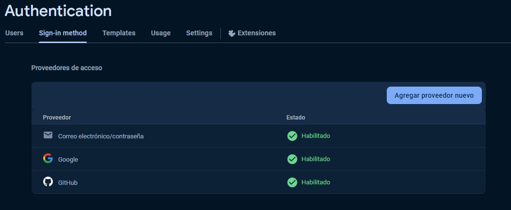

# Actividad 9 - Grupo 1
## Implementación de Autenticación en una Aplicación React con Firebase.
### Integrantes
- Marley Morales
- Steven Pozo
- Erick Ramírez

## Configuración de Firebase
El archivo de configuración de firebase se encuentra en la carpeta src/config/firebase.js.
Como se trabaja con el SDK de Firebase debemos traer los componentes necesarios para usar la autenticación que serian:  
```jsx
import {getAuth, GoogleAuthProvider} from 'firebase/auth'
{ getFirestore } from 'firebase/firestore';
```

## Configuración de la autenticación 
 

En código tenemos que importar los componentes siguientes:
```jsx
import { auth, googleProvider } from "../config/firebase";
import { createUserWithEmailAndPassword, signInWithPopup, signOut , signInWithEmailAndPassword} from "firebase/auth";
```

Si queremos autenticarnos con google usamos la función signInWithPopup
```js
signInWithPopup(auth, googleProvider);
```
Podemos incluirlo dentro de una funcion asincrónica
```js
const signInWithGoogle = async () => {
    try {
      await signInWithPopup(auth, googleProvider);
      Swal.fire({
        icon: 'success',
        title: 'Inicio de sesión exitoso',
        showConfirmButton: false,
        timer: 1000,
      });
      navigate('/dashboard');
    } catch (err) {
      Swal.fire({
        icon: 'error',
        title: 'Error de Inicio de Sesión',
        text: err.message,
      });
    }
  };
```

Si queremos autenticarnos mediante un correo y contraseña debemos usar la función signInWithEmailAndPassword y enviar como parámetro auth, correo y la contraseña obtenidos del formulario
```js
signInWithEmailAndPassword(auth, email,password);
```

## Ejecutar la aplicación localmente
Primero instalar todas las dependencias del proyecto usando
```bash
npm i
```
Iniciamos nuestro servidor de desarrollo
```bash
npm run dev
```
