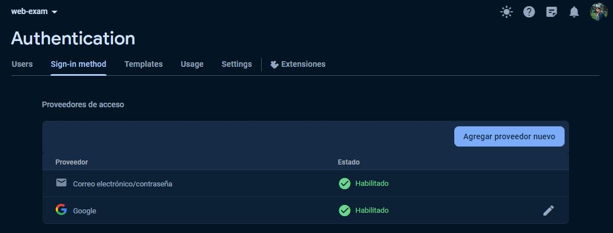

# Examen Parcial 2 - Grupo 1
## Desarrollo de un Sistema de Inventario de Bodega
### Integrantes
- Marley Morales
- Steven Pozo
- Erick Ramírez

Este proyecto se centra en el desarrollo de un sistema de inventario para una bodega utilizando tecnologías modernas en el front-end y el backend. A continuación, se proporciona una guía para configurar, desarrollar y ejecutar el proyecto de manera efectiva.

## Tecnologías Utilizadas
Front-end: React con Vite para una configuración rápida y eficiente del proyecto.
Backend: Firebase

## Configuración de Firebase
El archivo de configuración de firebase se encuentra en la carpeta src/config/firebase.js.
Como se trabaja con el SDK de Firebase debemos traer los componentes necesarios para usar la autenticación que serian:  
```jsx
import {getAuth, GoogleAuthProvider} from 'firebase/auth'
{ getFirestore } from 'firebase/firestore';
```

## Configuración de la autenticación 
 

En código tenemos que importar los componentes siguientes:
```jsx
import { auth, googleProvider } from "../config/firebase";
import { createUserWithEmailAndPassword, signInWithPopup, signOut , signInWithEmailAndPassword} from "firebase/auth";
```

Si queremos autenticarnos con google usamos la función signInWithPopup
```js
signInWithPopup(auth, googleProvider);
```
Podemos incluirlo dentro de una funcion asincrónica
```js
const signInWithGoogle = async () => {
    try {
      await signInWithPopup(auth, googleProvider);
      Swal.fire({
        icon: 'success',
        title: 'Inicio de sesión exitoso',
        showConfirmButton: false,
        timer: 1000,
      });
      navigate('/dashboard');
    } catch (err) {
      Swal.fire({
        icon: 'error',
        title: 'Error de Inicio de Sesión',
        text: err.message,
      });
    }
  };
```

Si queremos autenticarnos mediante un correo y contraseña debemos usar la función signInWithEmailAndPassword y enviar como parámetro auth, correo y la contraseña obtenidos del formulario
```js
signInWithEmailAndPassword(auth, email,password);
```

## Integración con el Backend
Se ha utilizado la base de datos propia de Firebase que es Realtime Database, en ella se ha creado 2 colecciones una para el manejo del historial de los productos y otro para la información de los productos

## Consumo de Servicios Web
Se ha utilizado axios para realizar solicitudes HTTP como lo tenemos implementado en el archivo instancia.js
```js
import axios from "axios";
export default axios.create({
  baseURL: "https://web-exam-6c390-default-rtdb.firebaseio.com/",
});
```

## Navegación entre las vistas
Se ha utilizado rutas protegidas solo para 2 rutas en especifico que seria la de /dashboard y la de el historial de cada producto
```jsx
<Route
  path="/dashboard"
  element={<ProtectedRoute element={<Dashboard />} />}
/>
<Route
  path="/historial/:productName/:productCode"
  element={<ProtectedRoute element={<Historial />}/>}
/>
```
Todas las demás rutas estan definidas como públicas


## Ejecutar la aplicación localmente
Primero instalar todas las dependencias del proyecto usando
```bash
npm i
```
Iniciamos nuestro servidor de desarrollo
```bash
npm run dev
```
